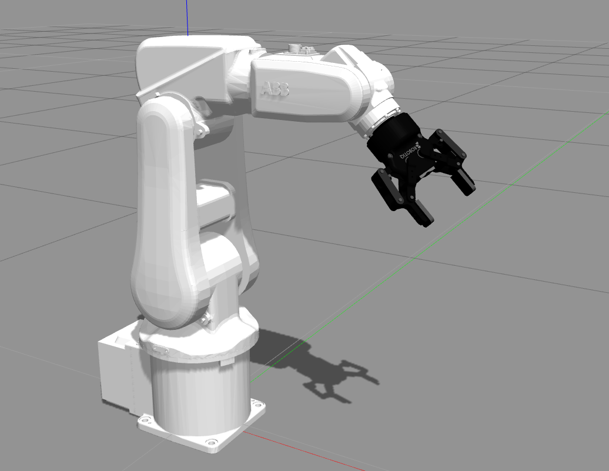

# irb120_robotiq85

This repo contains a Gazebo simulation for ROS Kinetic of the ABB IRB120 6-axis industrial robot with a Robotiq 85 2-finger gripper, as seen in the picture:



___

## Dependencies and installation

#### ABB IRB 120 industrial robot

1. The ABB IRB120 Gazebo simulation is taken from the ROS-Industrial (ABB experimental metapackage)[http://wiki.ros.org/abb_experimental]. Clone it to your catkin_ws using the kinetic-devel branch

```
https://github.com/ros-industrial/abb_experimental.git
```

2. The previous ABB experimental metapackage may depend of the main ROS-Industrial (ABB stack)[http://wiki.ros.org/abb]. Please install its kinetic-devel branch:

```
git clone https://github.com/ros-industrial/abb.git

```

#### Robotiq 85 gripper

The Gazebo simulation for the Robotiq85 gripper is taken from the repo provided by Stanley Innovation. Clone it to your catkin_ws and build it: 

```
git clone https://github.com/StanleyInnovation/robotiq_85_gripper.git
```


#### Install this package

Once you have installed the previous packages, clone this one, build your catkin_ws and source the setup.bash: 

```
git clone https://github.com/diegomrt/irb120_robotiq85.git
cd ..
source devel/setup.bash
```
___

## Usage

#### Gazebo simulation of the IRB120-Robotiq85 + Moveit config + Rviz plugin  

Launch the basic Gazebo simulation, including State and Command ROS controllers:
```
roslaunch irb120_robotiq85_gazebo irb120_robotiq85_gazebo.launch 
```
Launch the basic Gazebo simulation + MoveIt Commander
```
roslaunch irb120_robotiq85_gazebo irb120_robotiq85_gazebo_moveit.launch 
```
Launch the basic Gazebo simulation + MoveIt Commander + RViz including MoveIt plugin:
```
roslaunch irb120_robotiq85_gazebo irb120_robotiq85_gazebo_moveit_rviz.launch 
```
```
#### Basic Python programs to interface moveit_commander API

Forward kinematics plan and execution:
```
rosrun panda_diego forward_kinematics.py
```
Inverse kinematics plan and execution (move joints):
```
rosrun panda_diego IK_destination pose.py
```
Cartesian path (IK) plan and execution (move linear):
```
rosrun panda_diego IK_cartesian_path.py
```

## TO DO List as February 25, 2020

* Complete a pick and place example in Gazebo
* Add perception using a Kinect-like static depth camera
